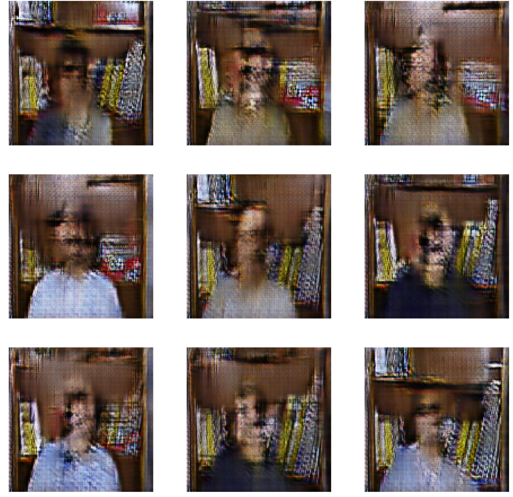
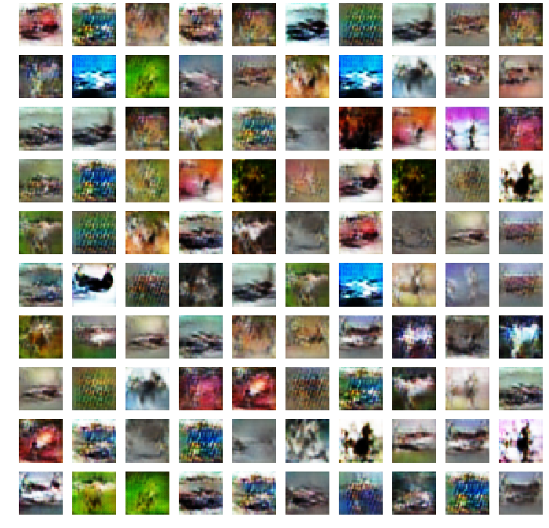

# GANs

## [DCGAN](/DCGAN)
DCGAN implementation using Tensorflow + Keras.  
Original paper: https://arxiv.org/pdf/1511.06434  
### Faces dataset results after 100 epochs.  
This dataset consisted of people sitting in front of a book shelf. The GAN did a good job of getting the bookshelf, books, shirt, and general structure of the person; however, it struggled in generating a face. I think with another 100 epochs of training the generator will learn how to create faces better.  o
  
### CIFAR10 results after 300 epochs  
The GAN was able to get the general style of this dataset. The results could definitely be improved with more hyperparameter tuning; however, other GAN architectures such as Conditional GAN have been proven to produce better results on this dataset.  
  
### MNIST results  
.png)
.png)
.png)  
.png)
.png)
.png)  
